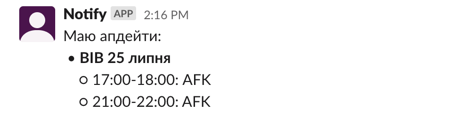
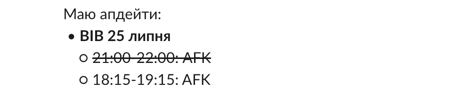

# Google Calendar - Slack Notifications Integration

Say goodbye to the old-fashioned method of manually 
notifying your colleagues about your AFK (Away From Keyboard) 
status in Slack. With this automated system, 
there's no need to repeatedly write and duplicate 
notifications in Google Calendar. Now, all you have 
to do is add an event to your calendar, and API 
will take care of the rest by automatically sending 
a message to the designated channel.

Even if you decline the event, 
system will handle it gracefully and send an 
appropriate message to the channel. Enjoy the 
convenience of this automated solution, or simply 
share the link with your colleagues to show them 
how to integrate Google Calendar with Slack using
[Google Calendar for Slack](https://slack.com/help/articles/206329808-Google-Calendar-for-Slack). 
Embrace efficiency and seamless communication with this approach!

## Technologies
- Slack API
  - send messages in the channel
- Google Calendar API
  - read events
- Google Sheets API
  - used as a storage of handling events
  - read/write events info
- NestJS
- TS
- date-fns

## Pre-Conditions

### Slack Bot Configuration:
- Create a Slack Bot in your workspace.
- Generate an App-Level Token: `SLACK_TOKEN`.
- Create an OAuth Token with the scope `chat:write`: `SLACK_BOT_TOKEN`.
- Obtain the Channel ID where the messages will be sent: `SLACK_CHAT_ID`.

### Google Service Account Setup:
- Create a Google Service Account.
- Grant the necessary permissions for the Service Account in Google Calendar.
- Specify the email of the account for which events will be scanned: `GOOGLE_CALENDAR_ID`.
- Create a spreadsheet and add permissions for the Service Account. Obtain the spreadsheet ID: `GOOGLE_SHEET_ID`.

### Additional Configurations:
- Specify the number of days you want to scan ahead for Google events: `COUNT_OF_DAYS_CHECK`.
- Define the phrase with which you want to start a message in Slack: `MESSAGE_HEADING`.

## Deployment
Currently, the check and notification process is 
initiated only by manually triggering the `/notify`
route. To automate this process, you can integrate a
[NestJS CronJob](https://docs.nestjs.com/techniques/task-scheduling) 
that will automatically trigger the `/notify` route on 
the server at specified intervals.

Additionally, you have another option to deploy the 
API on Google Cloud Run. By doing so, you can take 
advantage of Google Scheduler to schedule the frequent 
triggering of the `/notify` route based on your desired 
frequency. This approach ensures a seamless and automated 
execution of the check and notification process without 
manual intervention.

## How it works

> Make sure only events with the text `[out]` in title will be taken for further interaction

### New events in Google Calendar added

### Event deleted

### Event moved to other time

